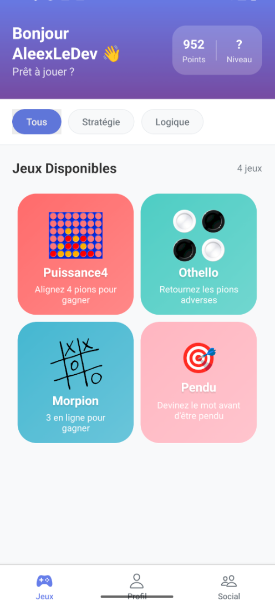
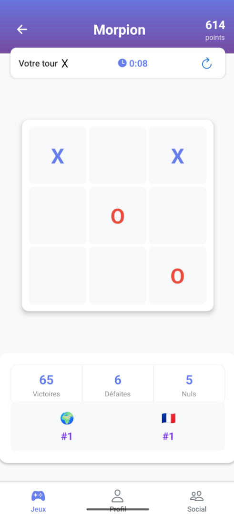
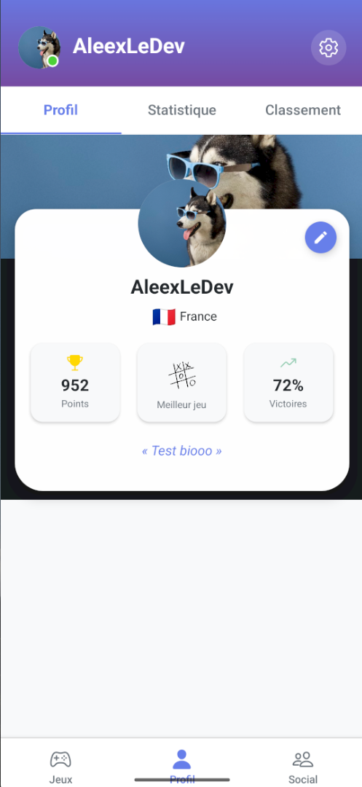
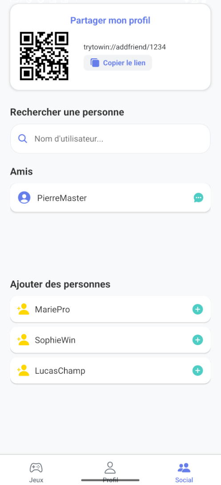

# TryToWin

**TryToWin** est une application mobile de jeux multijoueurs avec profils personnalisés, classement mondial et par pays, QR code de partage, et interface moderne.

## 🎮 Fonctionnalités principales

### Jeux disponibles

- **Puissance 4** - Alignez 4 pions pour gagner
- **Othello** - Retournez les pions adverses
- **Morpion / TicTacToe** - 3 en ligne pour gagner (avec IA Mistral)
- **Pendu** - Devinez le mot avant d'être pendu

### 🤖 Intelligence Artificielle

- **IA Mistral intégrée** dans le jeu Morpion
- Stratégies avancées et conseils tactiques
- Alternance intelligente entre joueur et IA
- Prompts optimisés pour une expérience de jeu enrichie

### 👤 Profils et Social

- Création et personnalisation avancée de profil (avatar, bannière, pays, bio, carrousel d'avatars)
- Classements : Top 10 mondial et par pays, pour chaque jeu et pour le profil
- Partage de profil via QR code ou lien unique
- Ajout d'ami par scan ou lien
- Statistiques détaillées par joueur et par jeu (victoires, défaites, nuls, points, séries de victoires, temps de jeu)

### 🎯 Système de Points

- Notifications toast personnalisées et harmonisées (succès, erreur, info)
- Gestion des scores avec multiplicateur de série de victoires
- Barème de points équilibré par jeu

### 🔐 Sécurité et Authentification

- Authentification sécurisée (Firebase) et gestion de la validation d'email
- Réinitialisation de mot de passe et gestion des erreurs utilisateur
- Upload et synchronisation de la photo de profil (Cloudinary)

### 🎨 Interface et UX

- Interface utilisateur moderne et responsive
- Support multi-plateforme (Android/iOS)
- Architecture modulaire (services, hooks, contextes, composants réutilisables)
- Effets visuels avancés (machine à écrire, textes animés)

## 📱 Aperçus de l'application






## 🚀 Technologies utilisées

- **Frontend** : React Native, Expo
- **Backend** : Firebase (Firestore, Authentication, Storage)
- **IA** : Mistral AI API
- **Navigation** : React Navigation
- **UI/UX** : React Native Animated, LinearGradient
- **Notifications** : React Native Toast Message

## 🔧 Configuration

1. Configurer Firebase dans `src/utils/firebaseConfig.js`
2. Ajouter la clé API Mistral dans `src/services/mistralService.js`
3. Configurer les variables d'environnement

## 📊 Architecture

```
src/
├── components/          # Composants réutilisables
├── constants/          # Constantes et configurations
├── contexts/           # Contextes React (Auth, Toast)
├── games/             # Logique des jeux
├── hooks/             # Hooks personnalisés
├── navigation/        # Configuration de navigation
├── screens/           # Écrans de l'application
├── services/          # Services (API, Firebase, IA)
└── utils/             # Utilitaires et configurations
```
